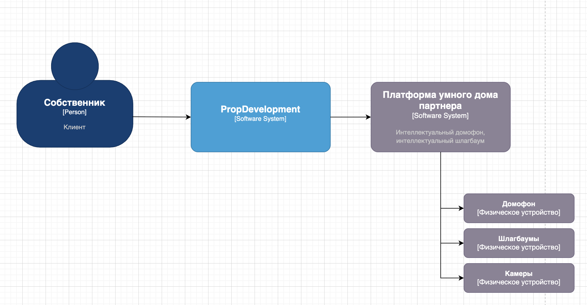
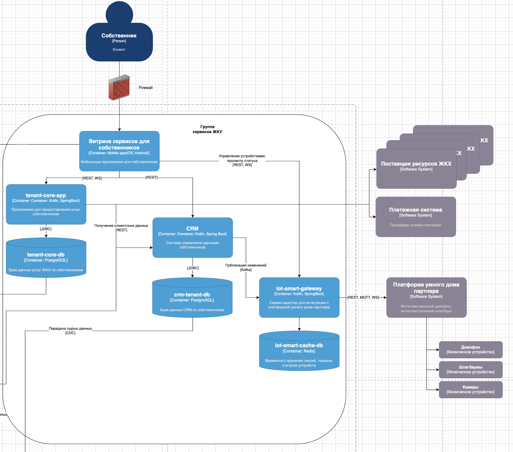

# Задание 3. Внешние интеграции

## Диаграмма контекста

[task3_c4_diagram.drawio](task3_c4_diagram.drawio) - страница "Контекст умного дома"

## Диаграмма контейнеров

[task3_c4_diagram.drawio](task3_c4_diagram.drawio) - страница "Контейнеры"

## Требования к безопасности

| Требование                                                                                                                                                                                   | Обоснование                                                                |
|----------------------------------------------------------------------------------------------------------------------------------------------------------------------------------------------|----------------------------------------------------------------------------|
| Передача биометрических данных (изображения лиц) должна осуществляться по защищенному каналу (TLS 1.3) и храниться только на стороне партнера в обезличенном виде (шаблоны, а не оригиналы). | Биометрия — специальная категория ПД по 152-ФЗ, требует повышенной защиты. |
| Данные о номерах автомобилей и список разрешенных лиц должны передаваться с минимальной детализацией (только необходимое).                                                                   | Принцип минимизации данных.                                                |
| Все запросы к платформе партнера должны логироваться с указанием времени, типа операции, идентификатора пользователя (без ПД в логах).                                                       | Обеспечение аудита и расследования инцидентов.                             |
| В случае компрометации учетных данных партнера должен быть механизм отзыва всех активных токенов доступа.                                                                                    | Управление инцидентами.                                                    |
| Доступ к командам "открыть домофон/шлагбаум" должен быть строго авторизован (проверка прав пользователя на устройство).                                                                      | Предотвращение несанкционированного доступа.                               |

## Дополнительные требования при использовании MQTT
| Требование                                                                                                                                                                    | Обоснование                                                |
|-------------------------------------------------------------------------------------------------------------------------------------------------------------------------------|------------------------------------------------------------|
| MQTT-брокер должен быть развернут на стороне партнера или в защищенной облачной среде с взаимной аутентификацией по TLS-сертификатам.                                         | Обеспечение конфиденциальности и целостности сообщений.    |
| Проприетарные топики MQTT должны иметь четкую структуру, включающую идентификатор устройства (например, `/propdev/{device_id}/event`).                                        | Изоляция данных разных устройств и простота маршрутизации. |
| `iot-smart-gateway` подписывается на топики событий от всех устройств, авторизованных для работы с PropDevelopment.                                                           | Получение событий в реальном времени.                      |
| Для команд открытия/закрытия от приложения собственника допускается использовать как REST (синхронно), так и MQTT (если требуется мгновенное выполнение без ожидания ответа). | Гибкость выбора в зависимости от требований к задержке.    |
| Все MQTT-сообщения должны передаваться по TLS 1.2/1.3, логирование сообщений должно исключать ПД и биометрические шаблоны.                                                    | Соблюдение требований к конфиденциальности.                |

## Протоколы аутентификации и авторизации

| Требование                                                   | Рекомендуемое решение                                                                                                                                       |
|--------------------------------------------------------------|-------------------------------------------------------------------------------------------------------------------------------------------------------------|
| Аутентификация сервиса PropDevelopment на платформе партнера | OAuth 2.0 (Client Credentials) с периодической ротацией клиентских секретов. Либо API-ключ + подпись запроса (HMAC).                                        |
| Аутентификация пользователя (собственника)                   | Уже есть в приложении (Keycloak). При вызове `iot-smart-gateway` передавать JWT-токен, полученный при входе.                                                |
| Авторизация операций                                         | Проверка: имеет ли собственник доступ к конкретному домофону/шлагбауму (по номеру квартиры или автомобиля). Данные о правах хранятся в CRM (`tenant-core`). |
| Безопасность канала                                          | TLS 1.3 с взаимной аутентификацией (mTLS) для сервер-серверных вызовов.                                                                                     |

## Организация взаимодействия между системами PropDevelopment и внешней платформой

### Архитектурная схема взаимодействия

**Инициализация:**
- Администратор PropDevelopment через интерфейс управления (или автоматически) регистрирует устройства (домофоны, шлагбаумы) в платформе партнера, получает `device_id`.

**Синхронизация списков доступа:**
- При изменении состава жильцов или добавлении автомобиля `CRM` отправляет уведомление в `iot-smart-gateway`.
- `iot-smart-gateway` формирует список разрешенных лиц (ID пользователя, хэш лица не передается, только идентификатор) и список госномеров, отправляет в платформу партнера.
- Платформа обновляет свои ACL (списки доступа) для соответствующих устройств.

**Распознавание и открытие (режим реального времени):**
- Камера домофона или шлагбаума обнаруживает лицо/номер.
- Платформа партнера проверяет по своим локальным спискам, принимает решение.
- Если доступ разрешен, платформа открывает устройство и отправляет событие в `iot-smart-gateway`.
- `iot-smart-gateway` фиксирует событие (кто, когда, результат) и при необходимости уведомляет мобильное приложение собственника (например, запись в лог или пуш-уведомление).

**Управление через приложение:**
- Собственник нажимает "Открыть домофон" в приложении.
- Приложение отправляет запрос в `iot-smart-gateway` (с JWT).
- `iot-smart-gateway` проверяет право (через `CRM`) и, если OK, отправляет команду на платформу партнера.
- Платформа выполняет команду.

**Протоколы взаимодействия:**

| Действие                               | Инициатор                                                 | Протокол     | Канал |
|----------------------------------------|-----------------------------------------------------------|--------------|-------|
| Синхронизация списков доступа          | `iot-smart-gateway` -> платформа партнера                 | REST (HTTPS) | mTLS  |
| Отправка команды открыть (синхронно)   | `iot-smart-gateway` -> платформа партнера                 | REST (HTTPS) | mTLS  |
| Отправка команды открыть (асинхронно)  | `iot-smart-gateway` -> MQTT-брокер партнёра               | MQTT (TLS)   | mTLS  |
| Получение события распознавания        | Платформа партнёра -> MQTT-брокер -> `iot-smart-gateway`  | MQTT (TLS)   | mTLS  |
| Публикация события статуса устройства  | Платформа партнёра -> MQTT-брокер -> `iot-smart-gateway`  | MQTT (TLS)   | mTLS  |

### Обработка ошибок и повторные попытки:

| Требование                                         | Комментарии                                                                                                                                                                                                                                                                                                                                                                                                                   |
|----------------------------------------------------|-------------------------------------------------------------------------------------------------------------------------------------------------------------------------------------------------------------------------------------------------------------------------------------------------------------------------------------------------------------------------------------------------------------------------------|
| Очередь команд при недоступности платформы         | Команды управления (открыть домофон/шлагбаум), отправленные от `iot-smart-gateway` к платформе партнёра, должны помещаться в устойчивую очередь (например, Kafka). Повторные попытки выполняются по экспоненциальной задержке: 1 сек, 2 сек, 4 сек, 8 сек, 16 сек (максимум 5 попыток). Если после 5 попыток платформа недоступна, команда отменяется, а в лог и SIEM фиксируется инцидент "Превышен лимит повторов".         |
| Обработка ошибок при синхронизации списков доступа | При отправке списка разрешённых лиц или номеров автомобилей используется протокол с подтверждением (REST с кодом 2xx). Если платформа не подтвердила приём после 3 повторов (интервалы 5, 15, 60 секунд), операция ставится в отдельную очередь "отложенной синхронизации" и повторяется каждые 30 минут. При успехе – очередь очищается. При повторяющихся сбоях (более 5 неудач подряд) создаётся алерт для администратора. |
| Обработка событий потери соединения (MQTT)         | При разрыве MQTT-соединения `iot-smart-gateway` должен пытаться переподключиться с backoff (до 10 минут) и подписаться на все необходимые топики заново. Все неотправленные события (распознавание лиц, статус устройств) буферизуются локально (с ограничением по времени) и отправляются после восстановления соединения.                                                                                                   |
| Периодическая полная синхронизация                 | Для защиты от рассинхронизации раз в 24 часа `iot-smart-gateway` инициирует полную синхронизацию списков доступа: сравнивается хеш-сумма всех записей, и при несовпадении отправляется актуальный список.                                                                                                                                                                                                                     |
| Логирование и оповещение                           | Все ошибки, повторные попытки, успешные/неуспешные отправки команд должны логироваться в централизованной системе (ELK/Splunk). Логи должны содержать: timestamp, тип операции, ID устройства, количество попыток, код ошибки. ПД и биометрические шаблоны в логи не включаются. При превышении порога ошибок (например, более 10 ошибок за 5 минут) отправляется автоматическое уведомление в службу эксплуатации.           |

